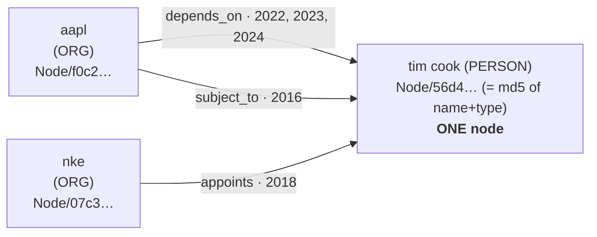
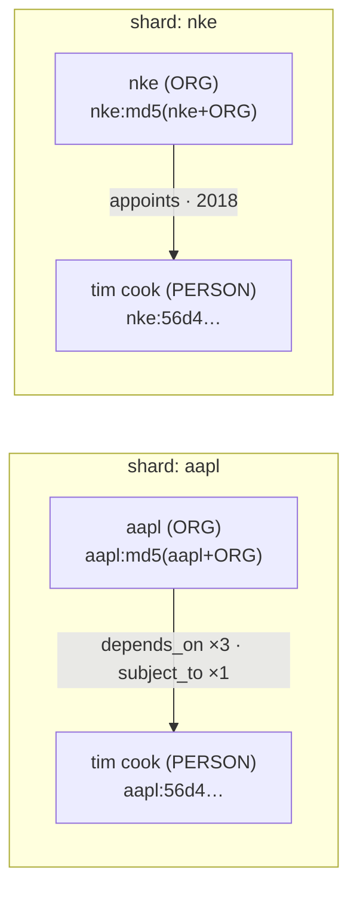
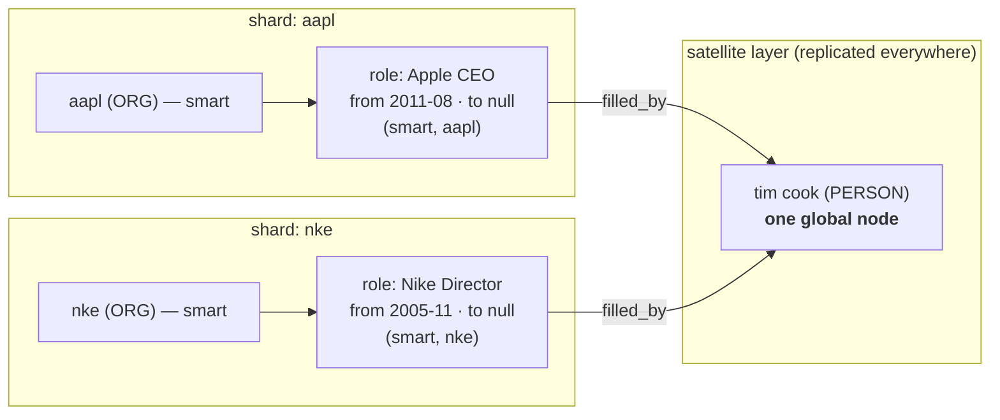

# Representing FinReflectKG as a SmartGraph — Options Analysis

**Status:** v1.0 · 2026-06-30 · for team review
**Author:** Arthur Keen (ArangoDB)
**Scope:** how to distribute the FinReflectKG knowledge graph across an ArangoDB
cluster as a **SmartGraph** — the options considered, the data evidence behind them,
the trade-offs, and the decision.
**Sources:** measured over the full dataset (DuckDB over the 103 source parquet shards)
and verified live on the 3.12.x Enterprise cluster. Backing detail in
`sharding-analysis.md`, `multi-distribution-plan.md` §5, `data-analysis.md`,
`load-report.md`.

---

## TL;DR

*These properties are consequences of how we currently model the source data, not
intrinsic facts about it — the graph can be re-modelled (§1, §1.2). Given the current
representation:*

- **In the source representation, no edge ever connects two companies.** As the data is
  modelled today (one edge per source triple), every triple is extracted from *one*
  company's 10-K and stamped with that one `ticker`, so both endpoints of any edge come
  from the same filing — **0.00% of edges are cross-company, by construction of this
  representation.** That makes the filing `ticker` the natural smart key and the
  per-company partition clean.
- **Entities *are* shared across companies, though** — ~17% of nodes (including ~15% of
  PERSON nodes) are referenced by more than one company. Sharing happens at **shared
  nodes** that multiple companies independently point to, *not* at cross-company edges
  (see §1.1). These shared nodes — generic metrics, accounting policies, and generic
  roles like `board`/`coo`/`treasurer` — are the "concept layer," and **27.7% of edges
  are concept→concept.**
- The shared layer can instead be a **satellite layer** (a hybrid design, Option B):
  companies form a **disjoint SmartGraph** sharded by `ticker`, **connected to satellite
  concept collections** replicated to every DB-Server. ArangoDB supports this directly —
  a disjoint smart subgraph may connect to satellite collections; it only may not connect
  to *another* disjoint subgraph (a different `ticker`), which never happens here.
  Concept↔concept edges (27.7%) live in the satellite layer. The cost is **replicating
  the concept layer to every DB-Server** and using **several edge collections** (a
  relation's two sides must each be all-smart or all-satellite) instead of one
  `relations` — which is what surrenders our single-collection fast path, *not* any
  impossibility.
- **Decision: a Disjoint SmartGraph sharded by `ticker`, with shared concepts
  duplicated per company** (no satellites). It maximises per-company locality and keeps
  our single-edge-collection query model (and its fast path) intact. Supernodes are
  handled by **vertex-centric indexes** (already built on every distribution); Option C
  adds per-company *locality* on top so no shard holds a hotspot. The cost is bounded
  node duplication (~2.1×) and aggregating cross-company concept queries by name.

---

## 1. What the *current representation* implies (and the choices behind it)

**Important caveat — the data does not "force" any of this.** We're working with a
graph, and there are many valid ways to represent this information. The properties below
are **consequences of the modeling choices we inherited from the source**, not intrinsic
facts. Specifically, the current graph mirrors the source's row-per-triple form:

1. **one edge per source triple-occurrence** (provenance-preserving; only 8.49 M of the
   17.5 M rows are distinct `(entity,relationship,target)` triples — **~52% are repeat
   observations** across years),
2. **node identity = `(name, type)`** (md5), i.e. *no global entity resolution* beyond
   the source's normalization,
3. **a filing `ticker` stamped on every edge**, and
4. **no cross-filing links** — we never connect two companies' subgraphs beyond what a
   single filing asserts.

Choices (3) and (4) are *why* the graph looks like a disjoint per-company union and why
`ticker` looks like the obvious smart key. **Different choices would change the
analysis** — most importantly, **global entity resolution** (one canonical `net income`,
one canonical `tim cook`, one canonical company) would create genuine cross-company
structure, make the graph *not* disjoint, and push toward global-identity layouts
(satellites / Option B) or a different key entirely. Other representations — reified
fact/observation nodes, a separate filer-vs-mentioned-entity layer, role/tenure nodes
(§2.2), an n-ary/qualifier model for temporal facts — would each shift the trade-offs.
So read the options and decision below as **"given the current representation, here is
the best distribution,"** not "the data dictates this." Re-modeling is on the table; see
§1.2.

With that framing, the measured shape of the current representation:

| Signal | Value | Why it matters for distribution |
|---|---|---|
| Edges / nodes / companies | 17.51 M / 3.10 M / 743 | sizing |
| **Cross-company *edges*** | **0.00%** | every triple carries one filing `ticker`, so no edge spans two companies — the per-company partition is clean *by construction* (not because entities are unique to companies — see §1.1) |
| Edges owned by the filer ORG | 87.2% | the filing `ticker` is the natural "owner" of an edge |
| Single-ticker nodes | 83% | most nodes belong to exactly one company |
| **Shared (multi-ticker) nodes** | **17%** | the "shared parts" — generic concepts, policies, and roles, referenced by many companies |
| Edge endpoint classes | company→company **16.0%**, company→concept **46.5%**, concept→company **9.9%**, **concept→concept 27.7%** | the 27.7% concept→concept decides the shared-layer design (duplicate per company, or put in a satellite layer) |
| Supernodes | 56 nodes with degree >10 K (e.g. `net income`, in-degree ~99 K) | generic metrics accumulate degree across all 743 companies |

Two consequences **(of this representation, not of the data per se)**:
1. **`ticker` is the natural smart key.** Given (3)+(4) there are no cross-company
   edges, so sharding by the filing company puts each company's subgraph on one shard and
   company-scoped queries stay local. Random/hash distribution would scatter every
   company across all DBServers. So *for this representation*: a smart key, and the key
   is `ticker`.
2. **The shared layer is the whole problem.** 17% of nodes and 27.7% of edges involve
   entities referenced by more than one company. How we place those is the real design
   question — and it's largely a question of whether we keep the source's
   per-mention identity or impose global identity (§1.2).

### 1.1 "But surely the companies share people and entities?" — yes, but the sharing is at *nodes*, not edges

This is the natural objection: multiple years of 10-Ks across 743 companies obviously
share directors, officers, regulators, and generic concepts. They do — and we verified
it live. The resolution is that **sharing is a property of nodes, not edges:**

- In a sample of 4,000 PERSON nodes, **616 (~15%) are referenced by more than one
  company**; ~17% of *all* nodes are multi-company.
- The most-shared "people" are **generic roles**, not named individuals (extraction
  normalizes/lemmatizes names): `chief information security officer` (162 companies),
  `controller` (84), `leadership team` (82), `coo` (80), `treasurer` (66), `board` (59).
  These behave just like the shared *concept* layer.

**Named individuals show up too — and most are single-company.** Spot-checking real
executives (live):

| `PERSON` node | # companies | Where |
|---|---|---|
| `elon musk` | 1 | `tsla` |
| `michael dell` | 1 | `dell` |
| `jensen huang` | 1 | `nvda` |
| **`tim cook`** | **2** | **`aapl`, `nke`** (Apple CEO + Nike board) |

Most named execs are discussed only in their *own* company's 10-K, so they sit entirely
within one company's subgraph — no duplication needed. The genuinely cross-company ones
are the interesting case: **`tim cook` appears in both Apple and Nike** (he's on Nike's
board). Under Option C he becomes `aapl:tim cook` and `nke:tim cook` — each copy holds
that company's edges; "what's Tim Cook connected to at Apple" stays on one shard, and
"everywhere Tim Cook appears" aggregates the two copies by name. (Two caveats from the
same check: `warren buffett`'s apparent "2 companies" is just the `brk.b`/`brk-b` ticker
spellings of *one* company — normalization noise, not real sharing; and `bill gates` has
**no node at all** — extraction is filing-scoped and Microsoft's 2014–2024 10-Ks don't
name him, so former founders can be absent.)

#### Worked example — Tim Cook, today vs. Option C (the chosen disjoint design)

His actual records (live): one `tim cook` PERSON node with 5 inbound edges — 4 from
Apple (`depends_on` 2022/2023/2024, `subject_to` 2016) and 1 from Nike (`appoints`
2018). What ties each edge to a company is its `_from` (the company ORG node) and its
`ticker` field — there is no Apple→Nike edge; the two companies only meet *at* this node.

**Today — `FinReflectKG`: one shared node, both companies point at it**

**Option C — Disjoint SmartGraph (sharded by `ticker`): one copy per company, each local to its shard**

The single node splits into `aapl:tim cook` and `nke:tim cook`
(key = `<ticker>:<md5(name|type)>`); Apple's 4 edges route to the Apple copy and Nike's
1 edge to the Nike copy, each fully on its company's shard. Nothing is lost — each edge
already carried exactly one `ticker`, so it maps cleanly to one copy. "Tim Cook at
Apple" is a one-shard lookup; "everywhere Tim Cook appears" resolves both copies **by
name** and unions them.

The general rule (beyond Tim Cook): a shared node like `board` is pointed at by edges
from `jpm`, `gs`, `bac`, … but **each carries its own single `ticker`** — there is no
`jpm`→`gs` edge. **Companies only ever meet *at* a shared node, never *across* an edge.**
That is the property the options in §2 exploit (by duplicating or replicating those
shared nodes) — and, per the caveat above, it holds only for the current representation
(§1.2).

### 1.2 We are not locked into the source's triple representation

The whole analysis above assumes the current row-per-triple model. We can re-model the
data; doing so changes the distribution question. The main alternatives:

| Alternative representation | What changes | Effect on distribution |
|---|---|---|
| **Global entity resolution** (canonicalize `net income`, `tim cook`, companies to one node each) | shared entities become genuinely shared, bridging companies | graph is **no longer disjoint** → `ticker` duplication (Option C) loses canonical identity; pushes toward **global-identity layouts** (satellites / Option B) or a non-ticker key |
| **Reified fact / observation nodes** (a `Fact` node per distinct `(e,r,t)`, with per-filing-year observation edges) | dedups to 8.49 M distinct facts (~52% of rows are repeats); time/provenance move onto observations | new node/edge counts; a natural home for temporal data; changes what "an edge" means for sharding |
| **Filer-vs-mentioned-entity split** (separate the 743 filers from the entities they mention) | clarifies ownership; could make filers smart and mentions satellite | a principled basis for Option B's company/shared split |
| **Role / tenure nodes** (§2.2) | reify person↔company appointments with `validFrom`/`validTo` | lets people stay single global (satellite) nodes; targeted temporal model |
| **n-ary / qualifier model** (facts with date/source qualifiers as first-class) | richer temporal & provenance semantics | heavier; only if temporal/provenance querying becomes central |
| **Harmonizing *additional* sources** — other structured datasets, and/or GraphRAG extraction over new unstructured text | new data may **not** be filing/`ticker`-scoped, may introduce entities with no single company owner, and may add **genuine cross-company links** | erodes the "every edge has one `ticker`" and "disjoint" assumptions → can force global-identity layouts or a different/compound key |

**This dataset is unlikely to stay a single, homogeneous source.** It is plausible that
other data will be **harmonized into** it over time — additional **structured** datasets,
and/or facts extracted from **unstructured text via GraphRAG import**. That matters here
because the entire "disjoint by `ticker`" argument rests on a property of *this* source:
every triple is filing-scoped and carries one company `ticker`. Newly harmonized data
may carry **no `ticker`**, may describe entities **shared across companies**, or may
assert **direct company-to-company links** — any of which **breaks disjointness** and
weakens `ticker` as the smart key. So the distribution choice should be treated as
**revisable as sources are added**, and a design that depends hard on strict
disjointness (Option C) is more brittle to source harmonization than a **global-identity
layout** (entity resolution + satellites/Option B), which absorbs heterogeneous,
cross-cutting data more gracefully.

**Why Option C is still the right call now:** the immediate requirement is a SmartGraph
with **text co-located with the entities it relates to**, which is inherently
per-company — so keeping the source's per-mention identity and sharding by `ticker` fits
*that* use case and is the cheapest path (no entity-resolution project). The honest
framing: **Option C is the best choice given the current representation and the current
use case — not because the data dictates it.** If/when additional sources are harmonized
in, or the priority shifts to global cross-company analytics or a canonical knowledge
graph, entity resolution + a global-identity layout becomes the better foundation, and
we revisit.

---

## 2. The options (given the current representation)

> **Note on the smart key:** the smart key in every SmartGraph option below is
> `ticker` — i.e. **the company's stock symbol**. With 0% cross-company edges and a
> `ticker` on every edge, the stock symbol is the natural and chosen smart key; the
> options differ only in how they handle nodes that have *no single* stock symbol (the
> shared concepts and people).

### Option A — Random / hash distribution (no smart key)  ❌
Shard everything by `_key`. Simple, no modelling. But it ignores the disjoint
structure: a company's nodes and edges scatter across all shards, so the typical
"expand this company" query hits every DBServer. **Rejected** — it throws away the one
property (no cross-company edges) that makes this graph cluster-friendly.

### Option A′ — Non-disjoint SmartGraph by stock symbol, *no* duplication  ❌
Use `ticker` (stock symbol) as the smart key but **don't** duplicate shared nodes —
assign each shared concept a single (arbitrary) stock symbol and leave it there. The
catch: edges from *other* companies to that concept then have **mismatched smart values
on their two endpoints**, so they become **cross-shard** in a non-disjoint SmartGraph.
Since **company→concept is 46.5% of all edges**, this scatters nearly half the graph —
losing locality exactly on the heavily-referenced shared layer. **Rejected** — "smart
key = stock symbol" only delivers locality when paired with a shared-node mechanism
(duplication → Option C, or satellites → Option B); on its own it doesn't.

### Option B — Disjoint SmartGraph (companies) connected to a satellite concept layer  ⚠️
The "SmartGraph with satellites for the shared parts," done the way ArangoDB actually
supports it — a **disjoint company SmartGraph hanging off a satellite concept layer**:
- `Node` = **smart** collection, sharded by `ticker`, `isDisjoint: true` (the 83%
  company-owned nodes; each company is its own disjoint subgraph).
- `SharedNode` = **satellite** collection (the 17% shared concepts — one global identity,
  replicated to every DB-Server, read-local everywhere).
- **company↔concept edges (smart↔satellite, 56.4%)** — fully supported; "all smart nodes
  can be connected to satellite nodes." Sharded by the company; the satellite endpoint is
  local everywhere.
- **concept↔concept edges (satellite↔satellite, 27.7%)** — supported; they live entirely
  **within the satellite layer** (a satellite edge collection, replicated everywhere).
- **company↔company edges (16%)** stay within one `ticker` — fine. The *only* prohibition
  is connecting **two different** disjoint subgraphs (different `ticker`s) directly, and
  there are **0%** of those.

The one structural consequence: because a relation's two sides must each be
type-homogeneous (all-smart or all-satellite), the edges can't all sit in one
`relations` collection — they split into **several edge collections by endpoint type**
(company→company, company→concept, concept→company, concept→concept). (The earlier spike
that errored — *"…required to be a smart collection. But would be created as
satellites."* — was an attempt to keep one mixed-type edge collection; the supported form
is the layered split above.)

**Net:** fully feasible and a clean layered design. Pros: **no duplication**; concepts
keep **one global identity**; concept reads are local on every DB-Server; cross-company
analytical traversals (§3.1) keep working. Cons: the concept layer — its **nodes (17%)
and the concept→concept edges (27.7%)** — is **replicated to every DB-Server** (verified
live; company↔concept edges are smart-sharded, not replicated), and the edge model
becomes **several collections** instead of one `relations`, which costs us the
single-collection VCI direct-edge fast path (§3 finding (a)).

### Option C — Disjoint SmartGraph, concepts duplicated per company (no satellites)  ✅ chosen
- Smart key = `ticker`; node key = `<ticker>:<hash(name,type)>`.
- A concept shared by N companies is **duplicated into each of those N companies'
  shards**, so every node has an owning company and **every edge is intra-shard** —
  including the former concept→concept edges. Fully **disjoint** (`isDisjoint: true`).
- One `Node` collection, one `relations` collection — unchanged from today.
- **Cost:** nodes grow to ~6.66 M (**2.1×**; edges are *not* duplicated). A concept
  like `net income` becomes ~743 small nodes instead of one, so "every company that
  discloses net income" must aggregate the copies **by name** (cheap — there's an index
  on `name`).

### 2.1 Collection mapping — Option B vs Option C (these are *not* the same collections)

The two designs have **different collection sets**, and where a name is reused (`Node`,
`relations`) it holds **different membership**. This is the part most likely to be
conflated, so it is spelled out explicitly.

**Option C — Disjoint SmartGraph: 1 vertex + 1 edge collection (+ chunks).**

| Collection | Kind | Sharding | Contents |
|---|---|---|---|
| `Node` | **smart** vertex (`smartGraphAttribute=ticker`) | by `ticker` | **all** nodes — company-owned *and* shared, shared ones **duplicated per referencing ticker** (~6.66 M docs) |
| `relations` | **smart** edge | by `ticker` | **all** 17.5 M edges, incl. concept→concept |
| `chunks` | **smart** orphan (or `distributeShardsLike: Node`) | by `ticker` | source text, co-located |

**Option B — Disjoint SmartGraph + satellite layer: 2 vertex + several edge collections (+ chunks).**
The edges split by endpoint type because a relation's two sides must each be all-smart or
all-satellite:

| Collection | Kind | Sharding | Contents |
|---|---|---|---|
| `Node` | **smart** vertex | by `ticker` | **only company-owned** nodes (83%), single copy each |
| `SharedNode` | **satellite** vertex | replicated to every DBServer | **only shared** nodes (17%), one identity, physically on all DBServers |
| `rel_company` | **smart** edge | by `ticker` (`distributeShardsLike` the smart `Node`) | company→company (smart→smart, 16%) |
| `rel_company_concept` / `rel_concept_company` | **smart** edge | by `ticker` (`distributeShardsLike` the smart `Node`) | company↔concept (smart↔satellite, 56.4%); the satellite concept endpoint is local everywhere, so the hop is still local |
| `rel_concept` | **satellite** edge | **replicated** to every DB-Server | concept→concept (satellite→satellite, 27.7%) |
| `chunks` | satellite or smart | — | source text |

> **Verified live (throwaway hybrid disjoint SmartGraph on the 3.12.x cluster):** the
> smart↔satellite edge collection comes up with `distributeShardsLike` the smart vertex
> collection and `replicationFactor: 1` — i.e. **smart-sharded, *not* replicated**. Only
> the satellite↔satellite edge collection comes up `replicationFactor: "satellite"`. So
> under Option B the replication cost is the **concept vertices (17% of nodes) + the
> concept→concept edges (27.7%)** — *not* the company↔concept edges.

**Logical entity → collection:**

| Logical entity | Option C | Option B |
|---|---|---|
| Company-owned node (1 ticker, 83%) | `Node` (smart) | `Node` (smart) |
| **Shared node** (≥2 tickers, 17%) — concepts, `board`, Tim Cook | `Node` (smart), **duplicated → N docs** | **`SharedNode`** (satellite), **1 doc replicated** |
| company↔company edge (16%) | `relations` (smart) | `rel_company` (smart) |
| company↔concept edge (56.4%) | `relations` (smart) | `rel_company_concept` / `rel_concept_company` (smart↔satellite) |
| **concept↔concept edge (27.7%)** | `relations` (smart) — endpoints duplicated, so ticker-local | **`rel_concept`** (satellite edge, replicated) |
| Source text | `chunks` (smart by `ticker`) | `chunks` |

**Where they explicitly do *not* correspond:**

1. Option C has **one** edge collection (`relations`) for *all* edges and **one** vertex
   collection (`Node`). Option B has a separate satellite vertex collection (`SharedNode`)
   and **splits edges into several collections by endpoint type** — none of which exist in
   Option C.
2. `Node` membership differs: Option C `Node` = *everything* (company + duplicated
   shared); Option B `Node` = *company-owned only* (shared nodes live in `SharedNode`).
3. Option C's single `relations` holds all edges; Option B has no single edge collection
   at all — edges are partitioned by (from-type, to-type).
4. Option B needs two classification steps Option C does not: label each node
   company-owned vs shared (→ `Node` vs `SharedNode`), and route each edge by its
   endpoints' types (→ the right edge collection).

**Tim Cook, concretely:**
- **Option C:** two docs in **`Node`** — `Node/aapl:56d4…`, `Node/nke:56d4…`; his 5 edges
  in **`relations`**.
- **Option B:** one doc in **`SharedNode`** — `SharedNode/56d4…` (no prefix), replicated
  to every DBServer. His 5 edges are company→person = **smart↔satellite**, so they live in
  the **`rel_company_concept`** (smart→satellite) edge collection — **not** the
  concept→concept satellite collection (`rel_concept` is strictly satellite↔satellite).

### 2.2 Refinement (for the satellite option): reified role / tenure nodes

A way to make the **satellite option (B)** elegant for *people* — keeping an individual
as a **single** global node instead of duplicating them — is to **reify the appointment
as a node**. Instead of `company → person` edges, introduce a company-owned **role /
tenure node** carrying `validFrom`/`validTo`, that references the (satellite) person:

**Why it works with the distribution:** the role node is **company-owned (smart, sharded
by stock symbol)** and the person is the **satellite**, so the `role → person` edge has
**one smart endpoint** — so it lives in the smart edge collection (sharded by the role's
stock symbol; the person's replica is local). This means people **never need the
separate satellite edge collection** that concept→concept edges force, because there's
never a satellite-to-satellite edge.

**The data supports it** (measured live): `POSITION`-typed nodes already exist (**9,984**);
PERSON nodes already use role verbs — `serves_as` (21K), `holds_position` (19K),
`served_as` (13K), `member_of` (9K), `works_for` (6K), `held_position` (3.6K); and
**~99% of PERSON edges already carry a `startDate`**, so the from-dates are present.

**What it buys:** single global identity for the individual with **no duplication**;
clean **role-tenure** modeling (`validFrom`/`validTo`) — a *targeted* temporal model
exactly where identity-over-time matters, far cheaper than the full time-travel
blueprint (§6).

**Caveats:**
- **Only solves the PERSON/role dimension.** The 27.7% concept→concept edges
  (metric↔metric, policy↔policy, …) are not role-based, so they remain
  satellite→satellite — Option B's edge split is narrowed, not eliminated.
- **It's an ETL enrichment, not free:** the source has POSITION nodes, role verbs, and
  dates, but not clean reified `person–role–company–dates` appointments. The role
  vocabulary is messy (past/present variants; titles typed inconsistently as PERSON /
  ORG / POSITION), so synthesizing role nodes carries normalization risk.
- **Changes the schema/query shape** to a 2-hop `person → role → company` pattern.
- **Not needed by Option C (chosen):** there, Tim Cook is simply duplicated and the
  dates already live on the edges. This refinement matters if we revisit the satellite
  option, or if "track an individual's roles across companies over time" becomes a
  first-class requirement.

---

## 3. Key technical findings

Three findings drive the recommendation: (a) the edge model / fast path, (b) supernode
handling, and (c) the query workload (§3.1).

**(a) Option B fragments our fast path; Option C preserves it.**
On this 3.12.x cluster we verified that the fast access path is the **direct
edge-collection query** (`FOR e IN relations FILTER e._from == … AND e.type == … AND
e._toType == …`), which uses our vertex-centric indexes and narrows perfectly — *not*
pattern traversals, which fall back to the generic edge index. Our entire query layer
(benchmark queries, visualizer actions, Cypher→AQL) is built on a single `relations`
collection. Option B's split would force those direct queries to `UNION` several edge
collections, each with its own indexes — a permanent tax on the path we proved is fast.
Option C leaves `relations` whole.

**(b) Vertex-centric indexes are the primary supernode tool; Option C adds locality on
top.** To be clear: the supernodes are handled first and foremost by **vertex-centric
indexes (VCIs)**, which we already build on every distribution —
`relations(_from, type, _toType)` and `relations(_to, type, _fromType)`. On the
`net income` supernode (in-degree ~99 K), the typed **direct edge query** ("which ORGs
disclose net income") scans only the **59,315 matching edges** via the VCI instead of
all ~99 K. That selectivity win is independent of the distribution choice — it applies
to the baseline, OneShard, and either SmartGraph option. (Caveat, per `load-report.md`:
the VCI engages for *direct edge queries*, not pattern traversals, so supernode-touching
queries must be written as direct edge queries.)

What the **distribution** choice changes is a *different* axis — **locality** (how the
supernode's edges are spread across shards), not selectivity:
- Under **Option C**, `net income` is duplicated per company, so each copy carries only
  one company's edges. A company-scoped supernode query stays on a single shard, and no
  shard holds a 99 K-edge hotspot. (A *global* "all companies disclosing net income"
  still aggregates across shards and by name.)
- Under **Option B**, `net income` stays one node whose inbound edges live in the
  company-sharded smart collection — so a global scan still scatters across the cluster
  (the VCI helps *within* each shard, but you touch all shards).

So VCI (selectivity) and Option C's per-company decomposition (locality) **stack**;
the decomposition is a complement to the VCI, not a replacement for it.

### 3.1 Query workload vs. distribution — checking the 22 example queries (`cypher-queries.md`)

Distribution can't be judged in the abstract, so we checked Option C against the 22
representative queries in `cypher-queries.md`. The decisive mechanic: **under Option C a
node is duplicated per `ticker`, so a multi-hop path survives only if every edge on it
shares the same `ticker`.** A path that bridges two companies through a shared node
(e.g. company B appears in CINF's filing *and* in B's own filing) lands on `cinf:B` for
one hop and `B:B` for the next — **different documents — so the traversal breaks** (or
needs a name-based re-resolution + shard hop at each company boundary). A live probe
confirmed cross-`ticker` 2-hop paths are common (risk→dependency was 3/3 cross-ticker in
the sample).

| Bucket | Queries | Behaviour under Option C (disjoint by `ticker`) |
|---|---|---|
| **Global aggregation** | 1, 2 (type distributions) | distribution-agnostic; scatter-gather on any layout |
| **Company-scoped / within-filing** | 3, 4, 5, 13, 15 | **clean & local** — single-company root, all edges share that `ticker` |
| **Cross-company multi-hop bridges** | 6, 7, 8, 9, 10, 11, 12, 14, 16, 17, 18, 19, 20, 21, 22 | survive **only** where the path stays within one `ticker`; otherwise **break** and need rewriting (name re-resolution at each company hop). Dependency **cycles** (18, 22) and stakeholder→company→metric (6, 7, 9) are inherently cross-filing. |

So ~15 of the 22 — the richer analytical / GraphRAG traversals — depend on **global node
identity** to stitch facts across companies' filings, which is exactly what Option C's
duplication removes. This is the **opposite** pressure from finding (a): Option B's
single global identity *preserves* those bridges, while Option C *breaks* them.

**Resolution — this is a *why we have multiple distributions* point, not an Option C
defect:**
- The **cross-company analytical suite** should run on **OneShard (or the baseline)**,
  where global identity is intact and (on OneShard) there's no cross-DBServer penalty.
- The **disjoint SmartGraph** serves the **company-scoped, text-co-located** workload
  — where queries are rooted at one company and stay local.
- If that analytical suite is ever needed *on* the SmartGraph, those ~15 queries must be
  rewritten with name-based re-resolution at company boundaries — a real, documented cost.

---

## 4. Comparison

| Dimension | A: Random | B: Hybrid + Satellites | C: Disjoint + duplication ✅ |
|---|---|---|---|
| Per-company locality | poor | good | **best** |
| Edge model | single | **several (split by endpoint type)** | **single (unchanged)** |
| Preserves VCI direct-edge fast path | n/a | no (union needed) | **yes** |
| Supernode *selectivity* (VCI — all builds) | yes | yes | yes |
| Supernode *locality* (distribution) | hot | hot (global scatter) | **decomposed per company** |
| Concept identity | global | **global** | split (aggregate by name) |
| Company-scoped queries (1-hop, within-filing) | scatter | local | **local** |
| Cross-company multi-hop traversals (≈15 of the 22, §3.1) | work (global identity) | **work (global identity)** | **break / need name re-resolution** → run on OneShard |
| Node storage | 3.1 M | 3.1 M (17% replicated) | ~6.66 M (2.1×) |
| Edge storage | 17.5 M | 17.5 M (concept→concept 27.7% replicated ×N; rest smart-sharded) | 17.5 M |
| Build complexity / risk | low | **high** (2 vtx + several edge collections, hybrid rules) | medium |
| Is it a SmartGraph? | no | yes | **yes** |

---

## 5. Decision & rationale

**Chosen: Option C — Disjoint SmartGraph sharded by `ticker`, shared concepts
duplicated per company.**

The driving requirement (from the downstream text-to-graph consumer): a SmartGraph is a
**hard requirement of the text-to-graph tooling**, and the goal is to **co-locate the
text-to-graph elements with the entities they relate to** — there is no requirement for
SatelliteCollections specifically, and no current need for global single-identity
concept analytics. Given that, Option C is both the right fit and the better
engineering choice:

- It **is** a SmartGraph (satisfies the tooling requirement).
- **Best co-location**, including the source text: we also smart-shard the `chunks`
  (source-text) collection by `ticker`, so a company's nodes, edges, *and* the text
  they were extracted from all land on the same shard. (A satellite would *replicate*
  1.4 M chunks to every DBServer instead of co-locating them — the opposite of the
  requirement.)
- Keeps the single-`relations` model → the VCI fast path and **company-scoped** queries
  work unchanged. (Cross-company *multi-hop* queries are the exception — see §3.1; those
  belong on the OneShard/baseline graph.)
- Adds supernode *locality* on top of the VCIs: the per-company copies mean no shard
  holds a hotspot (VCIs already give the selectivity on every build).
- Disjointness is real (0% cross-company), so duplication is the only cost — bounded at
  2.1× nodes, and edges don't duplicate (nodes are ~100 B, so it's cheap).

**Accepted trade-off:** concept identity is split across companies, so global
cross-company concept queries (“which companies disclose metric X?”) aggregate
`BY name`. This is cheap with the `name` index, and we'll monitor it.

**Monitoring / when we'd revisit:** after the build we check the duplication ratio
(~2.1×, edges not duplicated), shard balance across the 743 tickers (watch the big
filers like `etr`/`pru`/`met`), and query locality (`explain` shows no cross-DBServer
`RemoteNode` on company-scoped queries). The only trigger to reconsider Option B is if
global cross-company concept rollups turn out to dominate the workload — in which case
we'd either switch to the satellite layer or materialise a concept-aggregate view.

---

## 6. Related question — the data spans 2014–2024, so do we need the time-travel blueprint?

A fair question that comes up because the 10-Ks span 11 filing years: should we model
this with ArangoDB's **time-traveling graphs blueprint** (immutable proxy + versioned
documents + `created`/`expired` intervals + `hasVersion`, traversed "as of T")?

**Recommendation: no — keep temporal data as edge properties.** The blueprint solves a
different problem than the one this data presents.

### What the data is: an append-only observation log, not versioned entities
The blueprint is designed for **mutable entities that evolve with supersession** (e.g. a
CMDB device whose config changes — you reconstruct the single valid version as of an
instant). FinReflectKG is the opposite shape: a pile of **dated observations**, each
extracted from one annual filing and stamped with its `year` + extracted
`startDate`/`endDate`. The same fact is **re-asserted every year, not replaced.** Live
example — `aapl --discloses--> net income`, edges per filing year:

| | 2014 | 2015 | 2016 | 2017 | 2018 | 2019 | 2020 | 2021 | 2022 | 2023 | 2024 |
|---|---|---|---|---|---|---|---|---|---|---|---|
| edges | 18 | 17 | 8 | 16 | 9 | 11 | 9 | 10 | 9 | 7 | 6 |

It appears in **every** filing year. There is no "version N supersedes N-1" relationship between these — they're independent,
overlapping assertions (this is also why **~52% of all rows are repeat observations**
across years — only 8.49 M of 17.5 M rows are distinct triples). Proxy/version modelling
would impose a supersession
semantics the data doesn't have.

### The temporal dimension is already first-class — on the edges
Every edge carries `year`, `startDate`/`endDate` (ISO `YYYY-MM`, sortable),
`startDateRaw`/`endDateRaw`, with a `rel_ticker_year` index. ~95% of edges have an
explicit `endDate` validity window (~4.5% are open-ended / `default_end_timestamp`). The
natural temporal questions are plain filters:

- *"what did company X report in filing year Y"* → `FILTER e.year == Y`
- *"relationships valid during a window"* →
  `FILTER e.startDate <= @t AND (e.endDate == null OR e.endDate >= @t)`
- *"how a relationship trended year over year"* → `COLLECT BY year` (the table above)

Query 19 in `cypher-queries.md` already does time-ordered impact chains this way.

### Cost / fit
The blueprint would explode 17.5 M edges into proxies + version documents + `hasVersion`
edges, require `WITH` clauses and as-of traversal logic throughout, and **work against
the disjoint-SmartGraph plan** (more collections to co-locate per company) — a large
remodel for a poor semantic match.

### When we'd revisit
Only if a genuine **versioned-snapshot** requirement appears — "reconstruct the full
entity-state graph as of an *arbitrary* instant, with supersession," at a scale where
property filters don't suffice. The proportionate upgrade short of the blueprint is a
**temporal index** (`relations(year, startDate)`) + a documented set of "as-of" AQL
patterns. The current per-filing grain already supports as-of-**year** reconstruction,
which matches how the data arrives (one annual filing at a time).

---

## Appendix — headline numbers

- 17,513,372 edges · 3,099,773 nodes · 1,384,513 chunks · 743 companies.
- **0.00% cross-company *edges*** (every triple carries one filing `ticker`); 87.2% of
  edges owned by the filer ORG.
- Nodes: 83% single-ticker, **17% shared across companies** (entities *do* repeat —
  sharing is at nodes, not edges). PERSON sample: 616/4,000 (~15%) multi-company;
  most-shared are generic roles (`board`, `coo`, `treasurer`, …).
- Duplicated model ≈ 6,658,668 nodes (2.1×).
- Edge endpoint mix: company→company 16.0%, company→concept 46.5%, concept→company
  9.9%, concept→concept 27.7%.
- Supernode example: `net income` (FIN_METRIC) in-degree ~99 K; typed direct query
  scans 59,315 matching edges via the `(_to, type, _fromType)` VCI (selectivity, on
  every build). Option C additionally decomposes it into ~743 per-company copies
  (locality).

---

## Verification status

Every key figure and ArangoDB-behavior claim in this document, and how it was checked
(2026-06-30):

**Re-derived from the source parquet (DuckDB, this review):**
- 17,513,372 edges · 3,099,773 nodes · 743 tickers.
- 83% single-ticker / **17% shared** nodes (2,572,439 / 527,334).
- Duplication factor **2.15×** (6,658,668 node copies).
- Endpoint mix **16.0 / 46.5 / 9.9 / 27.7%** (company→company / company→concept /
  concept→company / **concept→concept**).
- 87.2% of edges have the filer ORG as source.
- 8,490,524 distinct `(entity,relationship,target)` triples → **~52% of rows are repeat
  observations**.

**Queried live on `FinReflectKG` (this review):** node/edge/chunk counts; Tim Cook's 5
edges and the named-exec company counts; `POSITION` = 9,984; PERSON role-verb counts;
~99% of PERSON edges carry `startDate`; the `aapl → net income` per-year counts; the
cross-`ticker` 2-hop probe.

**ArangoDB behaviour — official docs (3.12):** disjoint SmartGraphs prohibit edges
between different `smartGraphAttribute` values; smart nodes may connect to satellite
nodes; a relation's two sides must each be all-smart or all-satellite.

**ArangoDB behaviour — live spike on the 3.12.x cluster (this review):**
- OneShard: DB `sharding: "single"`, collections `distributeShardsLike: "_graphs"`,
  single DBServer leader (the `FinReflectKgOneShard` build).
- Hybrid disjoint SmartGraph: the **smart↔satellite edge collection is smart-sharded**
  (`distributeShardsLike` the smart vertex collection, `replicationFactor: 1`); **only
  the satellite↔satellite edge collection is replicated** (`replicationFactor:
  "satellite"`). So Option B replicates the concept vertices (17%) + concept→concept
  edges (27.7%), not the company↔concept edges.
- VCI selectivity: the typed direct edge query for `net income` disclosers scans 59,315
  edges (the `FinReflectKgOneShard` `validate.py` run).

**Judgments / recommendations (not facts):** that Option C is the best fit for the
current use case; that the cross-company analytical suite belongs on OneShard/baseline;
the reified role-node refinement. These are reasoned positions, open to challenge.
